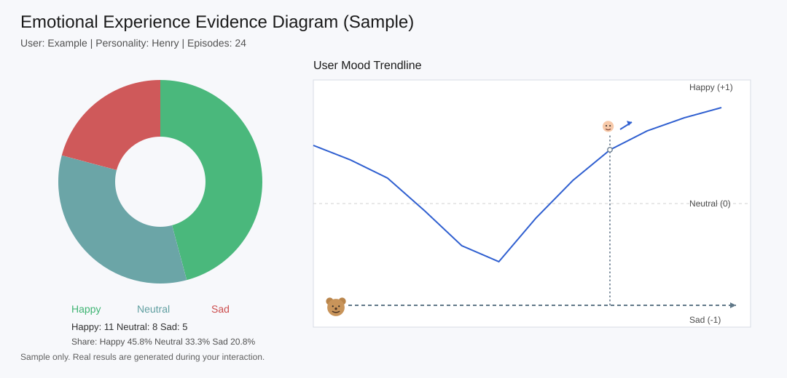

# Emotional Toys Meaningful Interaction Evidence

This page introduces how emotional interaction evidence can be reviewed as a readable visual artifact. Instead of relying on vague impressions, the diagram helps show how emotional states change, repeat, and connect across an interaction session.

## Emotional Evidence

HenryBear produces an emotional evidence bundle from runtime signals and learning state snapshots.

- Default output root: `interactive-toys/bin/Debug/net9.0/artifacts/emotion-evidence`
- Bundle output format: `emotion-evidence-YYYYMMDD-HHMMSS/`
- Bundle files:
  - `evidence.json`
  - `timeline.csv`
  - `diagram.svg`
  - `manifest.sha256.json`
- Viewer: [`emotion-evidence-viewer/README.md`](https://github.com/cartheur-joi/henry-bear/blob/main/emotion-evidence-viewer/README.md)

## Emotional Diagram (Sample)

The evidence diagram is the visual summary artifact intended for review and validation.

## How to Read This Diagram

Use the diagram as a compact map of emotional state over time:

- Treat each cluster as a moment or segment in the runtime interaction.
- Read directional links as transitions between emotional states.
- Compare dense vs sparse regions to identify recurring or unstable emotional patterns.
- Use labels and grouping to understand which emotional signatures are dominant in the session.

## How It Connects to the Evidence Bundle

The sample diagram is one artifact in a larger evidence set:

- `diagram.svg`: the visual structure shown above.
- `timeline.csv`: the chronological sequence that explains when transitions occurred.
- `evidence.json`: the structured data behind state/transition evidence.
- `manifest.sha256.json`: integrity metadata for reproducibility and verification.

## What This View Is For

This page is focused on the emotional diagram as a review artifact:

- quick inspection of emotional flow
- identifying repeated loops or sharp state changes
- comparing sessions at a high level before deeper JSON/CSV analysis

## Why This Emotional Toys Concept Matters

If you’re into emotional toys, this is worth looking at because it doesn’t fake emotion with static lines. It actually tracks emotional behavior over time and shows you what happened.

Why that’s useful in practice:

- You can spot patterns instead of guessing from one-off interactions.
- You can tune behavior using real evidence from sessions.
- Story goals and technical behavior stay connected because both show up in the same artifacts.
- Over time, it gives you a better shot at building toys that feel responsive instead of repetitive.
